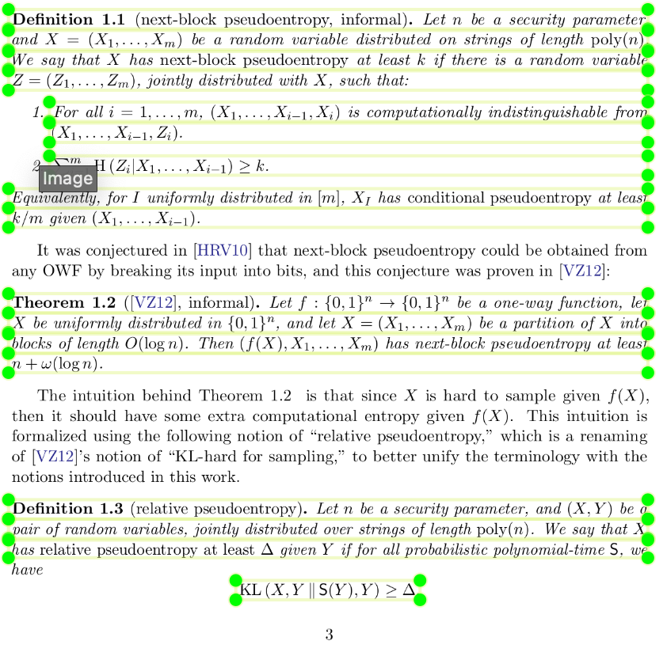
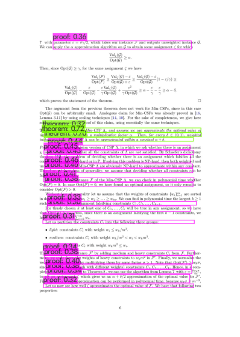
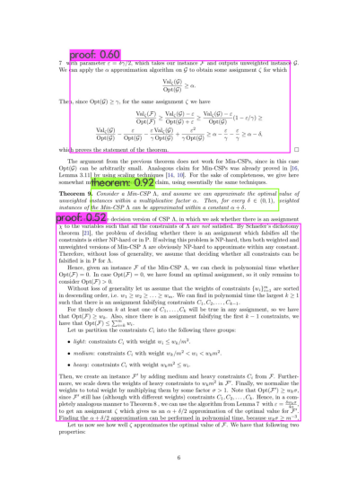
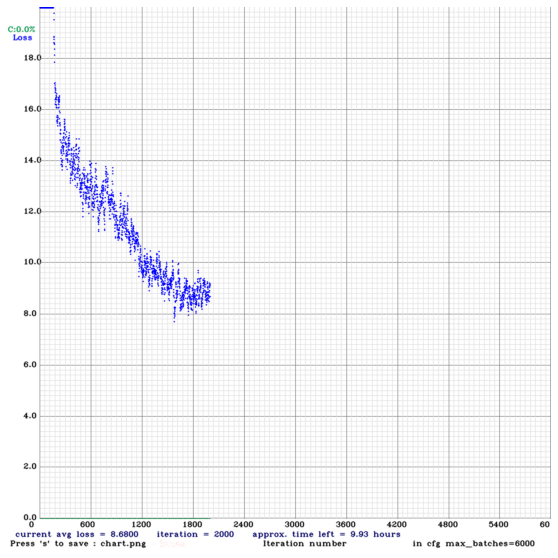

# TheoremKB

TheoremKB is a research project and a corresponding collection of tools
to extract semantic information from (mathematical) research articles.
This is an ongoing project, with preliminary code available from this
repository.

## Bibliography

For a high-level overview of the project, see [this set of slides](https://pierre.senellart.com/talks/sinfra-20191213.pdf).

For a more in-depth look at some of the aspects of the project, see:

- [Lucas Pluvinage](https://www.lortex.org/)'s Master Thesis on using
  style-based information for [Extracting scientific results from
  research articles](https://hal.inria.fr/hal-02956526).
- [Théo Delemazure](https://theo.delemazure.fr/)'s Master Thesis on
  first steps towards [A Knowledge Base of Mathematical(https://cnrs.hal.science/hal-02940819/)
  Results](https://hal.inria.fr/hal-02940819).
- [Shrey Mishra](https://www.linkedin.com/in/shreymishramv96/) presented an early proof of concept [Paper](https://hal.archives-ouvertes.fr/hal-03293643) comparing various techniques
  evaluated individually at a single line level.
- [Yacine Brihmouche](https://www.linkedin.com/in/yacine-brihmouche/)'s Master's thesis on [TheoremKB: a knowledge base of
Mathematical results](https://inria.hal.science/hal-03897168) connecting proofs and theorems from different papers.
- [Antoine Gauquier](https://www.linkedin.com/in/antoine-gauquier-0a176b152/)'s Master's thesis on [Impact of the document class in the automatic extraction of mathematical environments in the scientific literature](https://hal.archives-ouvertes.fr/hal-03293643](https://inria.hal.science/hal-04220990/document))
- [Antoine Gauquier](https://www.linkedin.com/in/antoine-gauquier-0a176b152/)'s paper on [Automatically inferring the document class used in a scientific article](https://inria.hal.science/hal-04379415/file/Final_report__AI311_GAUQUIER_Antoine.pdf).
- [Shrey Mishra](https://www.linkedin.com/in/shreymishramv96/)'s paper on [Multimodal Machine Learning for Extraction of Theorems and Proofs in the Scientific Literature](https://arxiv.org/abs/2307.09047).
- [Shufan JIANG](https://shufanjiang.github.io)'s paper on  [Extracting Definienda in Mathematical Scholarly Articles with Transformers](https://arxiv.org/pdf/2311.12448.pdf).

  
## Dataset

One of our dataset of reference is formed of 4400 articles extracted from
[arXiv](https://arXiv.org/), see [arXiv Bulk Data
Access](https://arxiv.org/help/bulk_data) for bulk access to the data.
For licensing reasons, this datasets cannot be reshared, but we provide
in [Dataset/links.csv](Dataset/links.csv) the reference to all articles of the
dataset.

## Tools

We are currently experimenting with the extraction of mathematical results 
based upon 3 approaches:

1. Using style-based information
2. Using Computer Vision based object detection to identify mathematical results 

 
 

3. Using NLP based techniques such as transformers and LSTM networks for sequence prediction

## Installation

For Computer Vision and NLP based extractions (Please follow the jupyter notebooks) in the directory 
`/Computer_Vision` and `NLP`

- Computer Vision notebooks

`/Computer_Vision/1.1 Computer vision preprocessing.ipynb` contains the preprocessing step and preparing the data into YOLO format
`/Computer_Vision/obj.data`, `/Computer_Vision/obj.names` , `/Computer_Vision/yolov4-obj.cfg` contains the image annotations directory path, class labels and configuration file of the YOLO network trained

- NLP notebooks

`/2.1 NLP text data preprocessing.ipynb` contains the preprocessing step and preparing of the xml files
`/transformers_tkb.ipynb` contains application of several AutoEncoding Transformers all base models (SciBert, Bert, DistilBert)
`/lstm_tkb_full.ipynb` contains LSTM implementation on Full data
`/lstm_trimmed.ipynb` contains LSTM implementation on imbalanced data

- Style based

See the instructions within the [Styling](Styling) directory.

## Participants and contact

The project is led by [Pierre Senellart](https://pierre.senellart.com/),
within the [Valda](https://team.inria.fr/valda/) research group joint
between [ENS, PSL University](https://www.ens.psl.eu/),
[CNRS](http://www.cnrs.fr/) and [Inria](https://www.inria.fr/).

The project has also involved:

- [Théo Delemazure](https://theo.delemazure.fr/), Master's student, ENS
- [Lucas Pluvinage](https://www.lortex.org/), Master's student, ENS
- Shrey Mishra, PhD candidate, ENS

Contact Pierre Senellart for further information.

## Funding

This work has been funded by the French government under
management of [Agence Nationale de la Recherche](https://anr.fr/) as part of the
“Investissements d’avenir” program, reference [ANR-19-P3IA-0001](https://anr.fr/ProjetIA-19-P3IA-0001)
([PRAIRIE 3IA Institute](https://prairie-institute.fr/)).

Pierre Senellart's work is also supported by his secondment to [Institut
Universitaire de France](https://www.iufrance.fr/).
